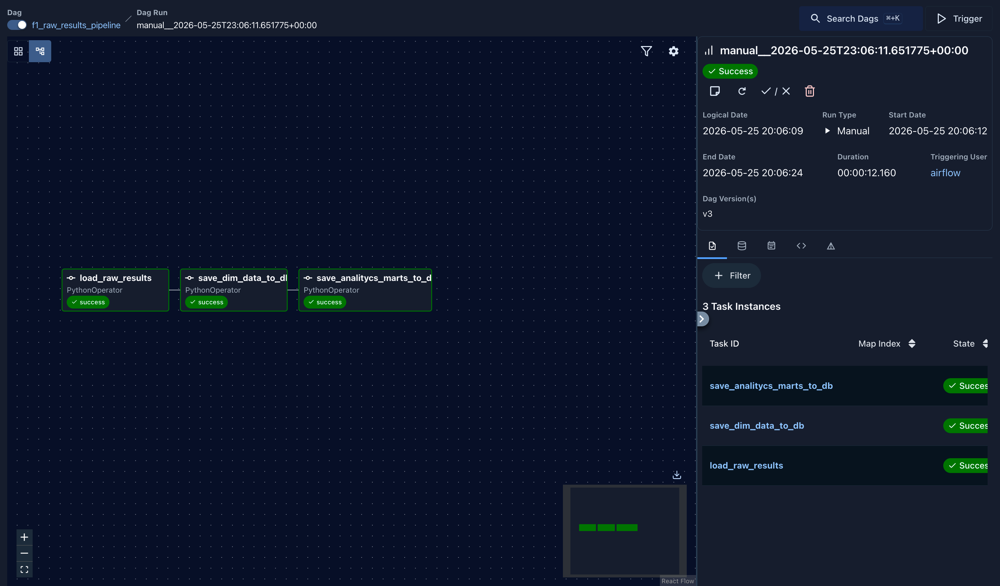
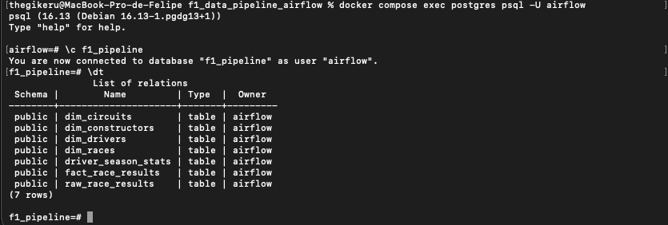
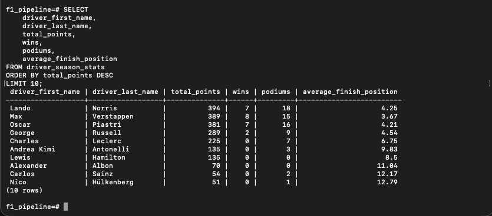
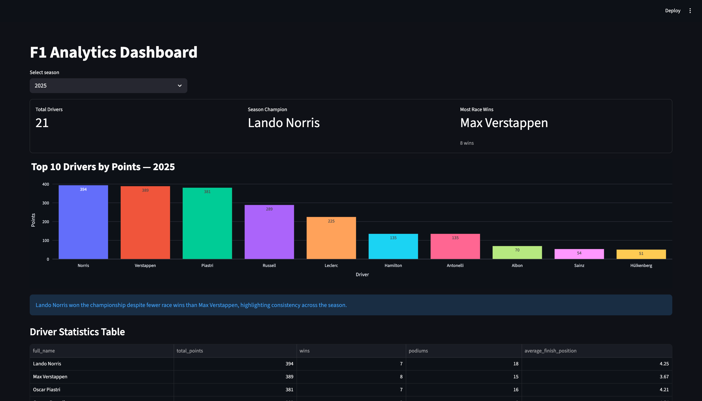

# 🏎️ F1 Data Pipeline with Airflow

End-to-end Data Engineering and Analytics Engineering project built with:

- Apache Airflow
- PostgreSQL
- Docker
- Python
- Pandas
- Streamlit
- Plotly

The pipeline extracts Formula 1 race results data from an external API, processes nested JSON responses, builds a dimensional data model, creates analytics marts, and serves analytical insights through an interactive dashboard.

---

# 📌 Project Goals

This project was created to simulate a real-world modern Data Engineering workflow:

- Extract data from an external API
- Handle pagination and nested JSON structures
- Build reusable ETL components
- Store raw and modeled data in PostgreSQL
- Orchestrate pipelines with Airflow
- Create dimensional and analytical models
- Generate analytics-ready datasets
- Deliver analytical insights through a dashboard

---

# 🏗️ Architecture

```text
API
↓
RAW LAYER
(raw_race_results)
↓
DIMENSIONAL MODEL
(dimensions + facts)
↓
ANALYTICS LAYER
(driver_season_stats)
↓
DASHBOARD LAYER
(Streamlit)
```

---

# 🧰 Tech Stack

| Technology | Purpose |
|---|---|
| Python | Data processing |
| Pandas | Data transformation |
| PostgreSQL | Data warehouse |
| Apache Airflow | Pipeline orchestration |
| Docker | Containerization |
| SQLAlchemy | Database connection |
| dotenv | Environment variables |
| Streamlit | Analytics dashboard |
| Plotly | Data visualization |

---

# 📂 Project Structure

```text
f1_data_pipeline_airflow/
│
├── dags/
│   └── f1_raw_results_pipeline_dag.py
│
├── dashboard/
│   ├── app.py
│   ├── queries.py
│   │
│   ├── charts/
│   │   └── driver_charts.py
│   │
│   └── components/
│       ├── insights.py
│       └── metrics.py
│
├── data/
│   └── raw/
│       ├── csv/
│       └── json/
│
├── src/
│   ├── extract/
│   │   ├── f1_results_api.py
│   │   └── snapshot_utils.py
│   │
│   ├── transform/
│   │   ├── build_dimensional_model.py
│   │   └── build_analytics_marts.py
│   │
│   ├── load/
│   │   ├── save_to_db.py
│   │   ├── read_from_db.py
│   │   └── load_dimensional_model.py
│   │
│   └── utils/
│       └── db_connection.py
│
├── images/
│   ├── airflow_dag.png
│   ├── postgres_tables.png
│   ├── driver_season_stats.png
│   └── dashboard_preview.png
│
├── main.py
├── docker-compose.yaml
├── requirements.txt
├── .env.example
└── .env.dashboard.example
```

---

# 🟤 RAW Layer

## raw_race_results

Stores the raw processed API response before dimensional modeling.

### Main Columns

```text
season
round
race_name
race_date

circuit_id
circuit_name
country
locality

driver_id
driver_code
driver_number
driver_first_name
driver_last_name
driver_nationality

constructor_id
constructor_name
constructor_nationality

grid
position
position_text
points
laps
status

race_time
race_time_millis

fastest_lap_rank
fastest_lap_lap
fastest_lap_time
fastest_lap_avg_speed
```

---

# 🔵 Dimensional Model

## Dimension Tables

### dim_drivers

Stores driver information.

### dim_constructors

Stores constructor/team information.

### dim_circuits

Stores circuit information.

### dim_races

Stores race metadata.

---

# 🟠 Fact Table

## fact_race_results

Stores race results for each driver in each race.

### Grain

```text
1 row = 1 driver result in 1 race
```

---

# 🟢 Analytics Layer

## driver_season_stats

Stores aggregated statistics for each driver in a season.

Built from the dimensional model using aggregated race-level metrics.

### Grain

```text
1 row = 1 driver in 1 season
```

### Columns

```text
season
driver_id
driver_first_name
driver_last_name
total_races
total_points
wins
podiums
dnf_count
average_finish_position
fastest_laps
```

---

# 📊 Dashboard Layer

Interactive analytics dashboard built with Streamlit and Plotly.

### Features

- Multi-season filtering
- Dynamic KPI cards
- Interactive Plotly visualizations
- Context-aware analytical insights
- Championship competitiveness analysis
- Driver consistency interpretation
- Driver statistics table
- Historical season comparison

### Main KPIs

- Total Drivers
- Season Champion
- Most Race Wins

### Dynamic Insights

The dashboard automatically generates contextual season insights based on:

- Championship winner
- Race wins leader
- Points gap between drivers
- Season competitiveness
- Driver consistency

Examples:

```text
"Lando Norris won the championship despite fewer race wins than Max Verstappen, highlighting consistency across the season."

"Max Verstappen led both points and race wins, but finished only 3 points ahead of Lewis Hamilton."
```

---

# 🔄 Pipeline Flow

## Step 1 — Extract

- API requests
- Pagination handling
- Nested JSON parsing
- Optional raw snapshots generation

## Step 2 — Raw Load

- Save raw processed data into PostgreSQL

## Step 3 — Transform

- Create dimensional model
- Standardize inconsistent IDs
- Remove duplicates
- Generate race_id

## Step 4 — Load Dimensional Model

- Save dimensions
- Save fact table

## Step 5 — Build Analytics Layer

- Create analytics marts
- Aggregate season statistics
- Generate KPI-ready datasets

## Step 6 — Load Analytics Tables

- Save analytics marts into PostgreSQL

## Step 7 — Dashboard Visualization

- Read analytics marts
- Generate visualizations
- Display dynamic insights

---

# ⚙️ Airflow DAG

## DAG ID

```text
f1_raw_results_pipeline
```

The DAG orchestrates:

```text
Extract
↓
Load RAW
↓
Build dimensional model
↓
Load dimensions and facts
↓
Build analytics marts
↓
Load analytics tables
```

---

# 📸 Screenshots

## 1. Airflow DAG

Screenshot showing successful pipeline orchestration and task execution.



---

## 2. PostgreSQL Tables

Screenshot displaying dimensional, fact, and analytics tables created in PostgreSQL.



---

## 3. Analytics Mart Example

Screenshot showing aggregated driver season statistics generated by the analytics layer.



---

## 4. Streamlit Dashboard

Screenshot of the interactive analytics dashboard with KPIs, visualizations, and dynamic insights.



---

# 📊 Query Examples

## Dimensional Model Query

Example query using fact and dimension joins.

```sql
SELECT
    d.driver_first_name,
    d.driver_last_name,
    r.race_name,
    f.position,
    f.points
FROM fact_race_results f
JOIN dim_drivers d
    ON f.driver_id = d.driver_id
JOIN dim_races r
    ON f.race_id = r.race_id
LIMIT 10;
```

---

## Analytics Query

Example query using the analytics layer to retrieve aggregated driver season statistics.

```sql
SELECT
    driver_first_name,
    driver_last_name,
    total_points,
    wins,
    podiums,
    average_finish_position
FROM driver_season_stats
ORDER BY total_points DESC
LIMIT 10;
```

---

# 🚀 Running the Project

## Start containers

```bash
docker compose up -d
```

---

## Access Airflow

```text
http://localhost:8080
```

---

## Run pipeline locally

```bash
python3 main.py
```

---

## Run Streamlit Dashboard

```bash
streamlit run dashboard/app.py
```

---

# 🧪 Data Quality Handling

The pipeline includes:

- Duplicate detection
- Duplicate removal
- ID standardization
- Data normalization
- Aggregated analytics marts
- Optional snapshot generation
- Defensive handling for missing API fields
- Multi-season historical processing support

---

# 📋 Logging

The pipeline includes logging for:

- Extraction steps
- API pagination
- Transformations
- Analytics marts generation
- Database load status
- Pipeline execution monitoring

---

# 🔐 Environment Variables

## Main Pipeline Environment

`.env.example`

```env
COMPOSE_PROJECT_NAME=f1_data_pipeline_airflow

# Set your local user ID
AIRFLOW_UID=

_PIP_ADDITIONAL_REQUIREMENTS=python-dotenv pandas sqlalchemy psycopg2-binary requests streamlit plotly

DB_USER=airflow
DB_PASSWORD=airflow
DB_HOST=postgres
DB_PORT=5432
DB_NAME=f1_pipeline
```

---

## Dashboard Environment

`.env.dashboard.example`

```env
DB_USER=airflow
DB_PASSWORD=airflow
DB_HOST=localhost
DB_PORT=5432
DB_NAME=f1_pipeline
```

---

# 📈 Future Improvements

- Constructor analytics dashboard
- Driver consistency analytics
- Race-level dashboards
- Incremental loads
- dbt integration
- Data quality tests
- CI/CD
- Cloud deployment
- Streamlit multi-page navigation
- Championship progression visualizations

---

# 👨‍💻 Author

Personal Data Engineering & Analytics Engineering portfolio project focused on:

- ETL development
- Data modeling
- Pipeline orchestration
- Analytics engineering
- Dashboard development
- Analytical storytelling
- Data visualization